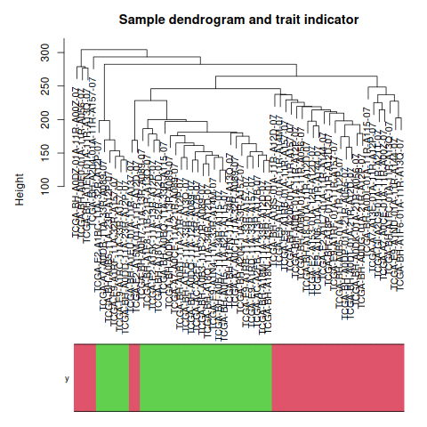
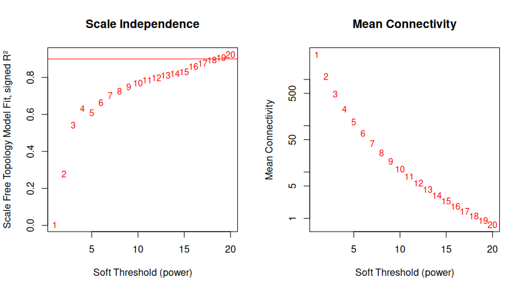
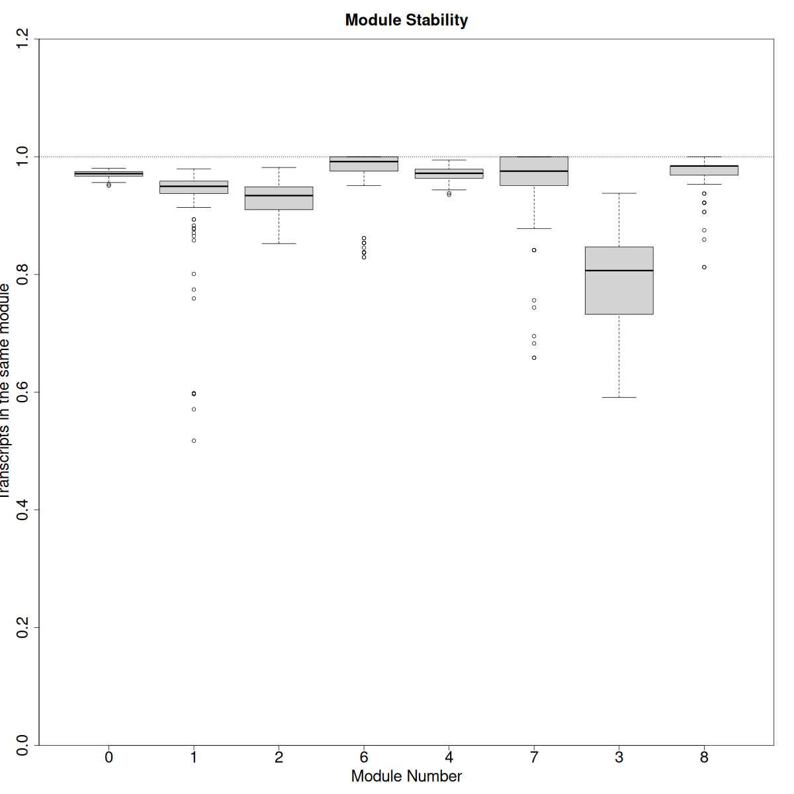
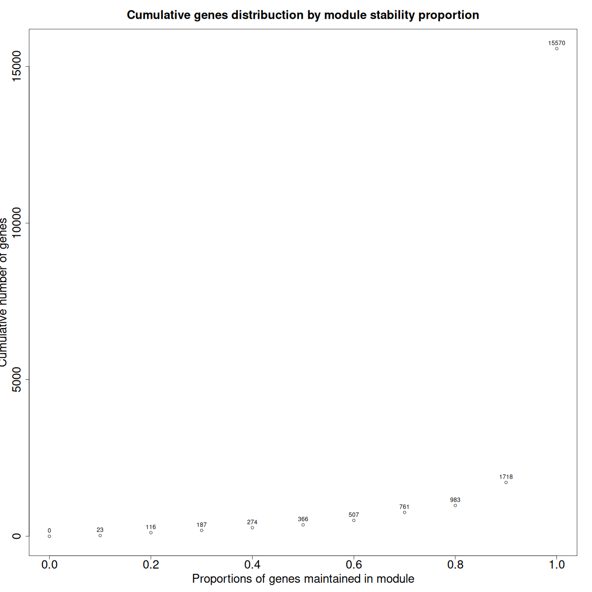
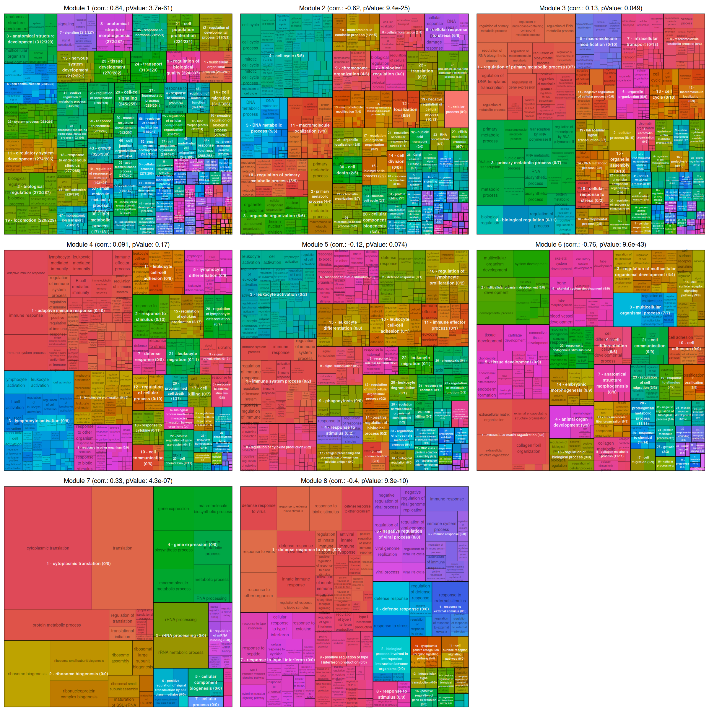
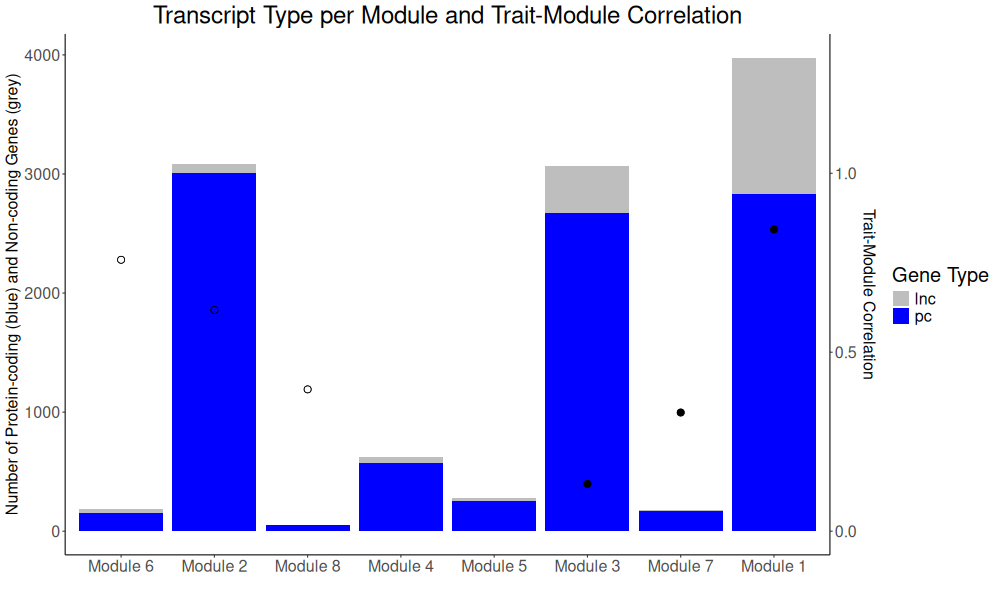
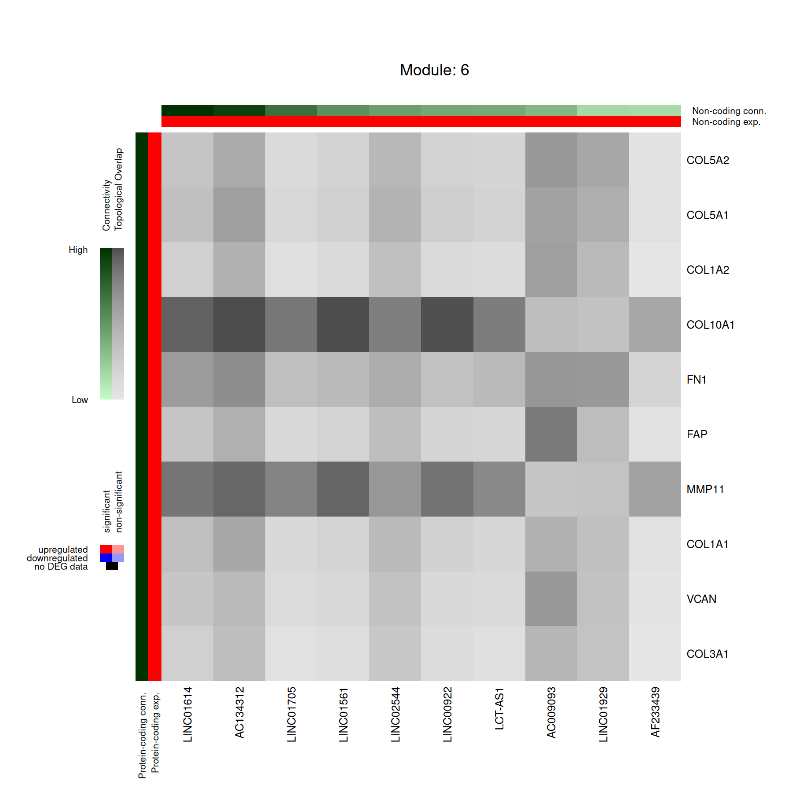
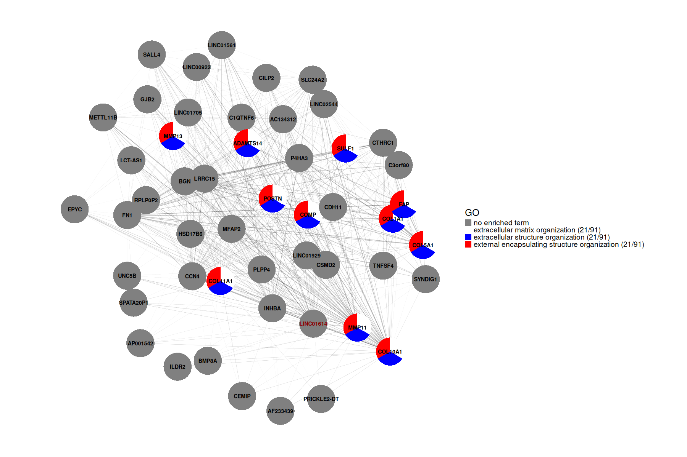
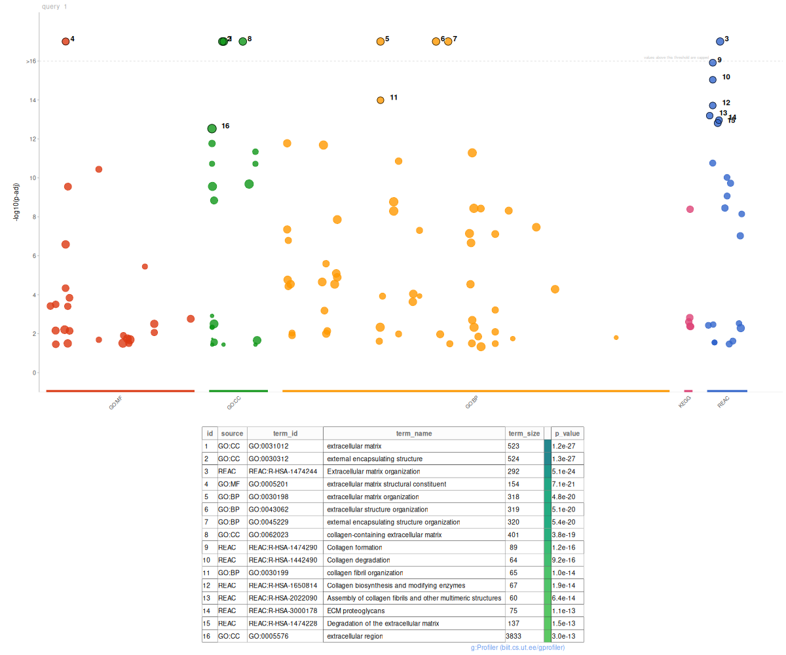

# lacen

## Introduction

`lacen` is an R package designed for analyzing gene expression data, with a focus on long non-coding RNAs (lncRNAs) and weighted gene co-expression network analysis (WGCNA).
It facilitates data handling, transformation and network construction, ensuring robust stability assessment through bootstrap analysis. It follows a simple and linear pipeline enabling an easy handling, mainly to users that dont have strong programming background. The package was built to work with human cancer datasets, but works well with datasets from several contexts, the only request is that expression data is from samples of two or more conditions, and the input files follows the required format. Beyound human data, `lacen`accepts the most common used organisms, following the [OrgDb bioconductor](https://www.bioconductor.org/packages/release/BiocViews.html#___OrgDb) supported organisms.

## Installation

`lacen` is not currently available in CRAN. To ensure all Bioconductor dependencies are installed, use BiocManager:

```r
if (!require("BiocManager", quietly = TRUE))
    install.packages("BiocManager")
BiocManager::install("sanches-leo/lacen")
```

## Loading the Data

As input, `lacen`requires five different files: 
    - The count dataframe, composed by the RNA-seq raw counts with the genes in the rows and samples in the columns. The gene name/ID should be in the row names and the sample names or ID in the column names.
    - The traits dataframe, indicating the which class does the sample is.  A two column dataframe, with the sample ID in the "Sample" column and the condition code on the "Trait" column. The conditions must be numeric codified, with each number indicating a different condition.
    - A differential expression dataframe. The user can use the standard Limma differential expression output, or give a dataframe with the columns "ID", "log2FC" and "pvalue", in this order.
    - The gene annotation data, a two columns dataframe with sequence IDs on "gene_id" column and Gene names on "gene_name" column. This dataframe can be obtained using `loadGTF()` to open an GTF file annotation or `downloadGTF()` the annotation using an web link.
    - The non-coding data, a subset of "annotationData" with only the non coding RNAs.
    
Obs: In the case of the user uses directly the gene name/symbol, both gene_id and gene_name columns could repeat the same gene_symbol.
    
    
The package includes a pre-processed TCGA reduced dataset to test, which can be loaded as follows:

```r
library(lacen)
data("annotation_data")
data("expression_DGE")
data("nc_annotation")
data("raw_expression")
data("traits")
```
Obs.: This data is a random subset of Paired tumor-adjacent tissue RNA-seq data from TCGA BRCA project. It was processed using TCGAbiolinks with STAR counts workflow. The full dataset script download is available by request.

## Creating a lacen Object

All data is handled within a `lacen-type S3 object`. The `initLacen` function initializes the object by integrating gene expression data, differential expression analysis, sample conditions, and gene annotation.

```r
lacenObject <- initLacen(annotationData = annotation_data,
                         datCounts = raw_expression,
                         datExpression = expression_DGE,
                         datTraits = traits,
                         ncAnnotation = nc_annotation)
```

## Checking Data Format

To ensure data compatibility, the `checkData` function verifies that all input datasets conform to the expected structure.

```r
checkData(lacenObject)
```

## Filtering and Transforming Data

The `filterTransform` function removes genes with low variation to prepare data for the network buinding. It allows filtering based on the expression variance of differentially expressed genes (DEGs) or the most variable genes (MAD) while applying necessary transformations.

```r
lacenObject <- filterTransform(lacenObject = lacenObject,
                               pThreshold = 0.01,
                               fcThreshold = 1,
                               filterMethod = "DEG")
```

Alternatively, the user can also input a personalized filtered and transformed data frame `lacenObject$datExpr <- filteredDataFrame`, with the sample names as column names and gene names as row names.


## Removing outliers

This function relies on WGCNA to plot the samples cluster Tree, helping to find the height value to exclude outlier samples.

```r
selectOutlierSample(lacenObject, height = FALSE)
```



When height is provided, the function will return the samples to keep.

```r
selectOutlierSample(lacenObject, height = 270)
```


To confirm the choose height, use `cutOutlierSample` to update it in the lacen object.

```r
lacenObject <- cutOutlierSample(lacenObject, height = 270)
```


## Picking the Beta-Value

To ensure the generated network will follow a scale-free topology, the choose soft-threshold should maximize the model fit ($R^2$) while minimizing the number of connections lost. 

```r
plotSoftThreshold(lacenObject,
                  filename = "2_indicePower.png",
                  maxBlockSize = 16000,
                  plot = TRUE
)
```



In this example, the value that maximizes the model fit to a scale-free topology is close to 15.

```r
lacenObject <- selectSoftThreshold(lacenObject = lacenObject,
                                   indicePower = 15)
```

After choosing the soft threshold value, confirm it using `selectSoftThreshold`.

## Bootstrapping

The bootstrap function makes the network n times, removing 1/n genes each repetition. Consequently, the less stable genes can be removed from the analysis.

```lacenObject <- lacenBootstrap(lacenObject = lacenObject)```







After analyzing the figures, the user can set the value of `setBootstrap` to remove genes less stable than this threshold.

```r
lacenObject <- setBootstrap(lacenObject = lacenObject, cutBootstrap = 10)
```

## Final network

The lacen core function automatically generates the final network, enrich the modules based on the given database, and returns the reduced enrichment as a png.

```r
lacenObject <- summarizeAndEnrichModules(lacenObject = lacenObject)
```

An enriched tree plot will be generated with the reduced enrichment of the modules, with the following information:
1- Module number
2- Module correlation with the trait and the correlation pvalue.
3- Submodule number
4- Submodule reduced enrichment description
5- Number of lncRNAs DEG over the lncRNAs highly connected with the submodule.

Obs.: As we expect that the lncRNAs has no described function in the enrichment databases, the guilty by association approach assumes that the lncRNA may have the same function as its co-expressed genes from the same module/submodule. Once the lncRNA may be highly connected with several submodules, there may be overlap between those lncrnas from several submodules.




## Modules Summarization

The modules are also summarized in a barplot as its protein-coding/non-coding genes and the trait-module correlation.

```r
stackedBarplot(lacenObject = lacenObject,
               filename = "6_stackedplot_desk.png",
               plot = TRUE)
```



## Enriched modules heatmap

This function generates a heatmap of a given module or module/submodule. The figure will exhibits the interconnectedness based on the topological overlap matrix between the lncRNAs and the protein coding genes. Following this approach, the usar may select lncRNAs highly connect within the module/submodule, and analyse its protein coding co-expressed genes.

```r
heatmapTopConnectivity(lacenObject = lacenObject,
                       module = 6,
                       submodule = 1)
                       
```



## lncRNA centered network

If the user is interest in lncRNAs that not clusterize in the modules or are not kept by the filters, `lacen` offers an alternative to analyse the most connected genes with the lncRNA of interest, plotting the network and enriching this subnetwork as well. 
Based on a lncRNA identifier and a LACEN object containing coexpression network data, and performs functional enrichment analysis based on the genes most highly correlated with the given lncRNA. It identifies the most connected genes with the specified lncRNA using the topological overlap matrix (TOM), enriches this group for functional terms such as Gene Ontology (GO) biological processes, molecular functions, cellular components, KEGG pathways, and Reactome pathways, and visualizes the resulting network and enrichment graph.
Obs.: This function should be used cautiously, once that as it ignores the module structure, it may be biased to the local hubs of the neighborhood.

```r
lncRNAEnrich(lncName = "LINC00665",
             lacenObject = lacenObject,
             nGenes = 300,
             nHighlight = 32,
             nGenesNet = 50,
             lncHighlight = FALSE)
```






## R Dependencies

    WGCNA,
    ggplot2,
    gprofiler2,
    fastcluster,
    rrvgo,
    limma,
    rtracklayer,
    foreach,
    doParallel,
    Polychrome,
    ggraph,
    graphlayouts,
    igraph,
    scatterpie,
    org.Hs.eg.db,
    methods,
    utils,
    stats,
    parallel

## Session Info

```
R version 4.4.3 (2025-02-28)
Platform: x86_64-pc-linux-gnu
Running under: Ubuntu 24.04.2 LTS

Matrix products: default
BLAS:   /usr/lib/x86_64-linux-gnu/openblas-pthread/libblas.so.3 
LAPACK: /usr/lib/x86_64-linux-gnu/openblas-pthread/libopenblasp-r0.3.26.so;  LAPACK version 3.12.0

locale:
 [1] LC_CTYPE=en_US.UTF-8       LC_NUMERIC=C               LC_TIME=en_US.UTF-8        LC_COLLATE=en_US.UTF-8    
 [5] LC_MONETARY=en_US.UTF-8    LC_MESSAGES=en_US.UTF-8    LC_PAPER=en_US.UTF-8       LC_NAME=C                 
 [9] LC_ADDRESS=C               LC_TELEPHONE=C             LC_MEASUREMENT=en_US.UTF-8 LC_IDENTIFICATION=C       

time zone: America/Sao_Paulo
tzcode source: system (glibc)

attached base packages:
[1] stats     graphics  grDevices utils     datasets  methods   base     

other attached packages:
[1] lacen_0.0.3

loaded via a namespace (and not attached):
  [1] splines_4.4.3               later_1.4.1                 BiocIO_1.14.0               bitops_1.0-9               
  [5] tibble_3.2.1                R.oo_1.27.0                 polyclip_1.10-7             preprocessCore_1.66.0      
  [9] XML_3.99-0.18               rpart_4.1.24                lifecycle_1.0.4             httr2_1.1.0                
 [13] fastcluster_1.2.6           doParallel_1.0.17           NLP_0.3-2                   lattice_0.22-5             
 [17] MASS_7.3-64                 backports_1.5.0             magrittr_2.0.3              limma_3.60.6               
 [21] Hmisc_5.2-2                 plotly_4.10.4               rmarkdown_2.29              yaml_2.3.10                
 [25] httpuv_1.6.15               askpass_1.2.1               reticulate_1.40.0           DBI_1.2.3                  
 [29] RColorBrewer_1.1-3          abind_1.4-8                 zlibbioc_1.50.0             GenomicRanges_1.56.2       
 [33] purrr_1.0.4                 R.utils_2.12.3              ggraph_2.2.1                BiocGenerics_0.50.0        
 [37] RCurl_1.98-1.16             yulab.utils_0.2.0           nnet_7.3-20                 tweenr_2.0.3               
 [41] rappdirs_0.3.3              GenomeInfoDbData_1.2.12     rrvgo_1.17.0                IRanges_2.38.1             
 [45] S4Vectors_0.42.1            tm_0.7-15                   ggrepel_0.9.6               pheatmap_1.0.12            
 [49] umap_0.2.10.0               RSpectra_0.16-2             codetools_0.2-20            DelayedArray_0.30.1        
 [53] xml2_1.3.6                  ggforce_0.4.2               tidyselect_1.2.1            UCSC.utils_1.1.0           
 [57] farver_2.1.2                viridis_0.6.5               matrixStats_1.5.0           stats4_4.4.3               
 [61] dynamicTreeCut_1.63-1       base64enc_0.1-3             GenomicAlignments_1.40.0    jsonlite_1.8.9             
 [65] tidygraph_1.3.1             Formula_1.2-5               survival_3.8-3              iterators_1.0.14           
 [69] systemfonts_1.2.1           foreach_1.5.2               tools_4.4.3                 ragg_1.3.3                 
 [73] Rcpp_1.0.14                 glue_1.8.0                  gridExtra_2.3               SparseArray_1.4.8          
 [77] xfun_0.50                   MatrixGenerics_1.16.0       GenomeInfoDb_1.40.1         dplyr_1.1.4                
 [81] withr_3.0.2                 fastmap_1.2.0               openssl_2.3.2               digest_0.6.37              
 [85] R6_2.6.0                    mime_0.12                   textshaping_1.0.0           colorspace_2.1-1           
 [89] GO.db_3.19.1                RSQLite_2.3.9               R.methodsS3_1.8.2           tidyr_1.3.1                
 [93] generics_0.1.3              data.table_1.16.4           rtracklayer_1.64.0          graphlayouts_1.2.2         
 [97] httr_1.4.7                  htmlwidgets_1.6.4           S4Arrays_1.4.1              scatterpie_0.2.4           
[101] scatterplot3d_0.3-44        pkgconfig_2.0.3             gtable_0.3.6                blob_1.2.4                 
[105] impute_1.78.0               XVector_0.44.0              htmltools_0.5.8.1           scales_1.3.0               
[109] Biobase_2.64.0              png_0.1-8                   wordcloud_2.6               ggfun_0.1.8                
[113] knitr_1.49                  rstudioapi_0.17.1           rjson_0.2.23                checkmate_2.3.2            
[117] curl_6.2.0                  org.Hs.eg.db_3.19.1         cachem_1.1.0                Polychrome_1.5.1           
[121] stringr_1.5.1               parallel_4.4.3              foreign_0.8-88              AnnotationDbi_1.66.0       
[125] treemap_2.4-4               restfulr_0.0.15             pillar_1.10.1               grid_4.4.3                 
[129] vctrs_0.6.5                 slam_0.1-55                 promises_1.3.2              xtable_1.8-4               
[133] cluster_2.1.8               htmlTable_2.4.3             evaluate_1.0.3              cli_3.6.4                  
[137] compiler_4.4.3              Rsamtools_2.20.0            rlang_1.1.5                 crayon_1.5.3               
[141] labeling_0.4.3              gprofiler2_0.2.3            fs_1.6.5                    stringi_1.8.4              
[145] viridisLite_0.4.2           WGCNA_1.73                  gridBase_0.4-7              BiocParallel_1.38.0        
[149] munsell_0.5.1               Biostrings_2.72.1           lazyeval_0.2.2              GOSemSim_2.30.2            
[153] Matrix_1.7-2                bit64_4.6.0-1               ggplot2_3.5.1               KEGGREST_1.44.1            
[157] statmod_1.5.0               shiny_1.10.0                SummarizedExperiment_1.34.0 igraph_2.1.4               
[161] memoise_2.0.1               bit_4.5.0.1   
```